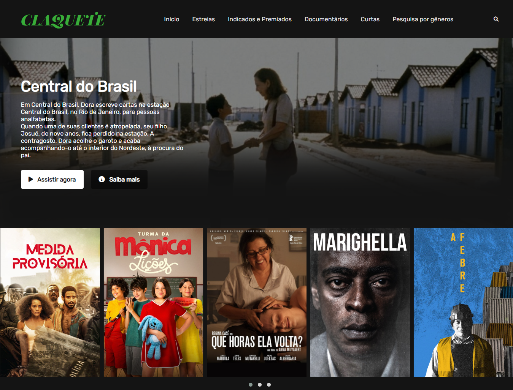

# Claquete  
> *"Claquete é um dispositivo usado no cinema e audiovisual para identificar os planos e tomadas rodados durante a produção, 
e também para ajudar na sincronização entre imagem e som."*

Recriação da interface da Netflix como uma plataforma de filmes, documentários e curtas exclusivamente brasileiros.  
O projeto utiliza os conceitos de containers, variáveis, [*Flexbox*](https://developer.mozilla.org/pt-BR/docs/Learn/CSS/CSS_layout/Flexbox) e responsividade. 

- Ferramentas utilizadas:
  - [Owl Carousel](https://owlcarousel2.github.io/OwlCarousel2/) (para o carrossel de filmes);
  - [Font Awesome](https://fontawesome.com/) (para os ícones);
  - [Google Fonts](https://fonts.google.com/).

## Capturas de tela
<table align="center">
  <tr>
    <th>Desktop</th>
    <th>Mobile</th>
  </tr>
  <tr>
    <td></td>
    <td></td>
  </tr>
</table>
